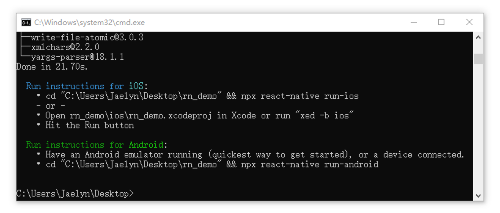
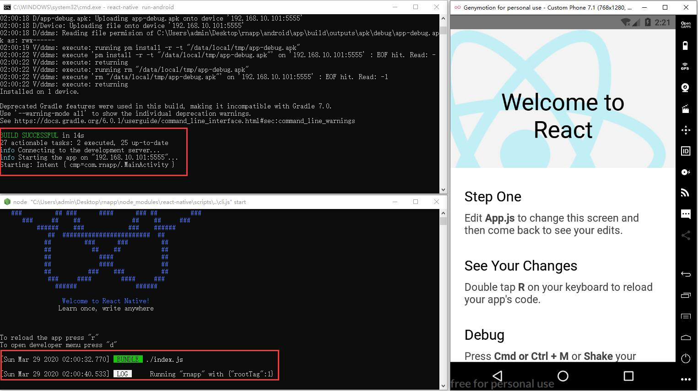

# 项目初始化

## 1. 准备工作

软件列表：

- Node.js
  - 下载地址：http://nodejs.cn/download/
- Java Development Kit（JDK）
  - 下载地址：https://www.oracle.com/java/technologies/javase-downloads.html
- Python
  - 下载地址：https://www.python.org/downloads/
- Android Studio（可选）
  - 下载地址：https://developer.android.google.cn/studio/
- genymotion（可选）
  - 下载地址：https://genymotion.en.softonic.com/download
- VirtualBox（与 genymotion 搭配使用）
  - 下载地址：https://www.virtualbox.org/wiki/Downloads

## 2. 软件安装配置

- Node.js 安装
- JDK 安装配置
- Python 安装
- Android Studio 安装配置
- genymotion 以及 VirtualBox 安装配置

以上具体安装配置过程参考对应文档。

## 3. 环境配置

- Java 环境变量：具体参考《JDK 配置》文档
- SDK 环境变量：具体参考《Android Studio 安装配置》文档

注：若有现成的 SDK 文件，可以选择只配置环境变量，不安装 Android Studio。

## 3. 脚手架安装

执行以下命令来全局安装 react-native-cli 脚手架工具：

```bash
npm i react-native-cli -g
```

若没有安装 yarn 的建议执行以下命令来全局安装 yarn 工具：

```bash
npm i yarn
```

## 4. 创建 React Native 项目

执行以下命令来创建 React Native 项目（其中 myapp 为项目名称，可更改）：

```bash
react-native init myapp
```



## 5. 启动项目

在启动项目前，先开启手机模拟器。

cd your app

启动命令

react-native run-android

出现以下界面即为启动成功。




