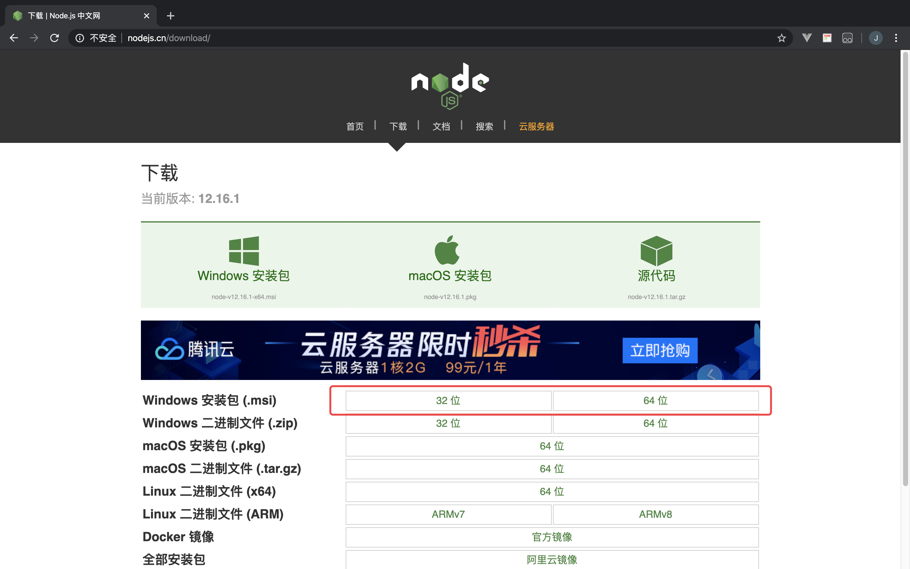
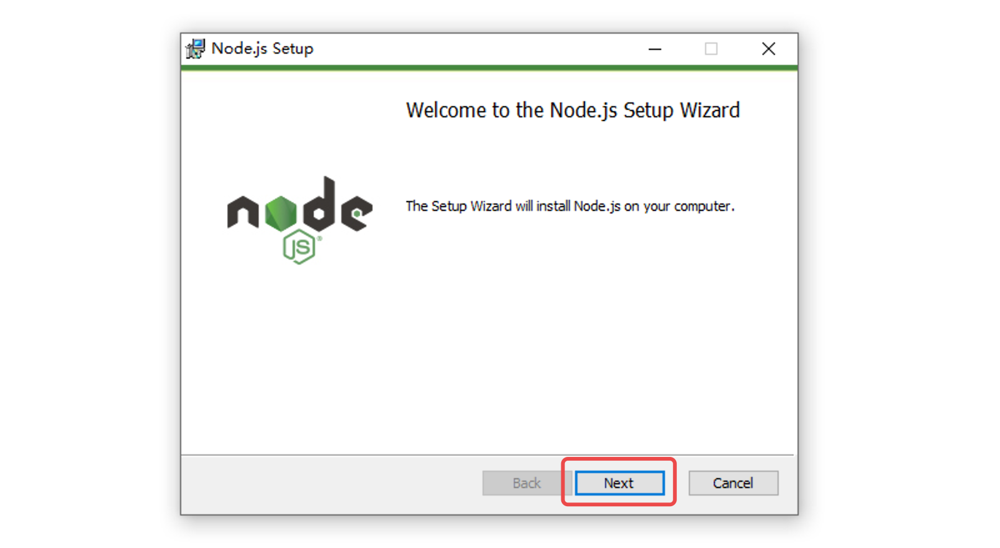
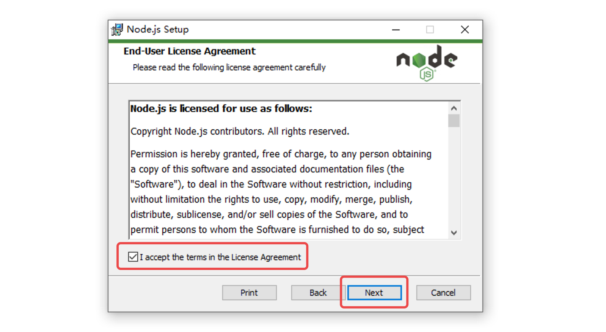
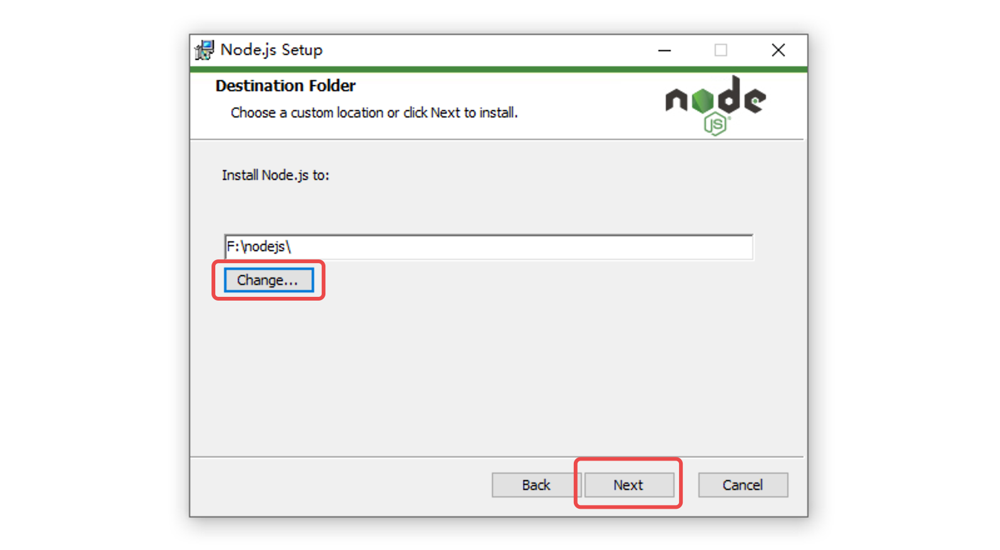
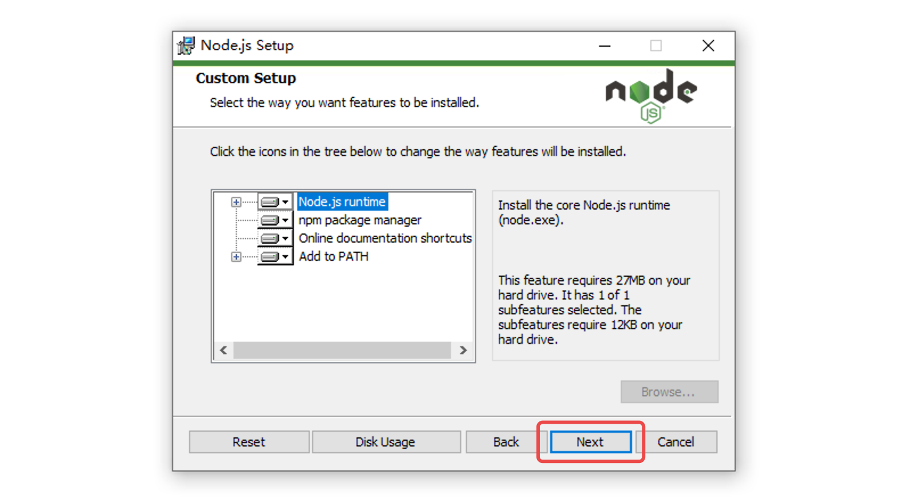
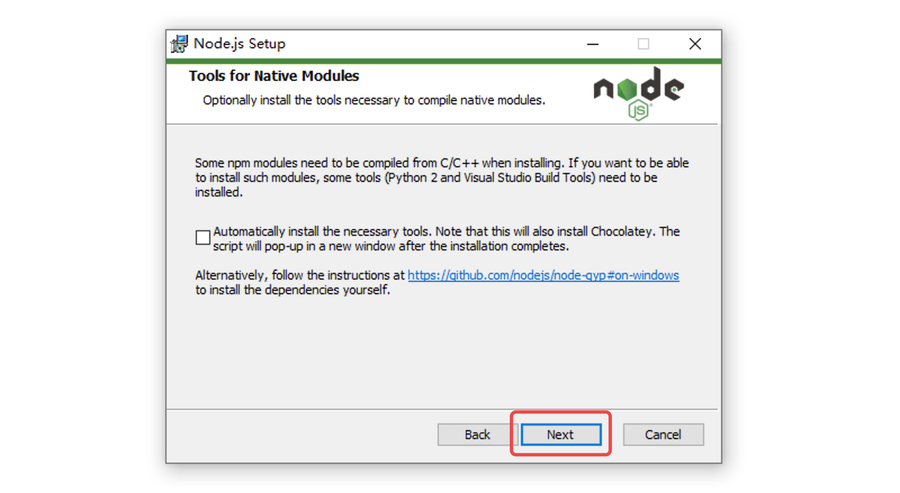
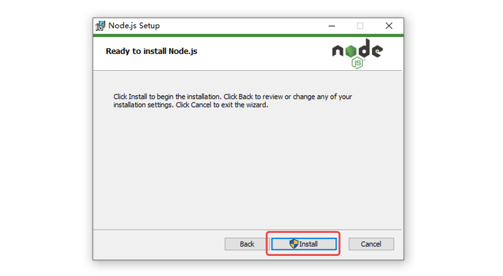
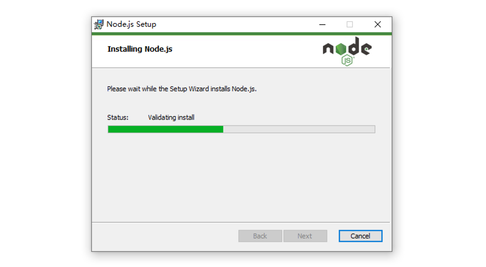
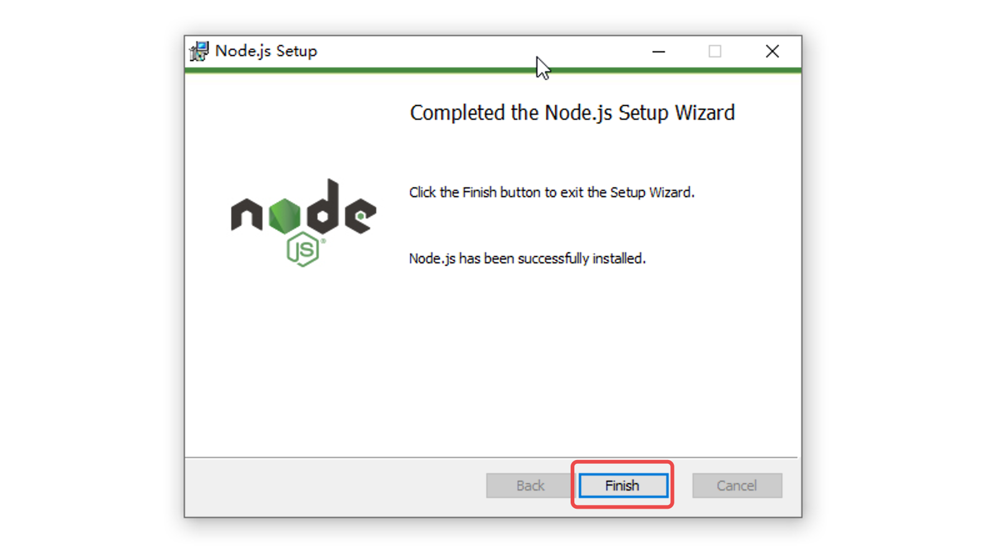

# Node.js 安装

## 1. 下载



## 2. 安装





点击「Change」切换安装路径，也可以直接点击「Next」采用默认路径。













## 3. 查看版本

可以通过查看 Node 版本来确定是否安装成功。

在命令行中输入以下命令：

```bash
node -v
```

出现版本号则说明安装成功。

## 4. 设置淘宝镜像

由于 npm 的下载速度太慢，在命令行中输入以下命令来设置淘宝镜像：

```bash
npm config set registry https://registry.npm.taobao.org
```

