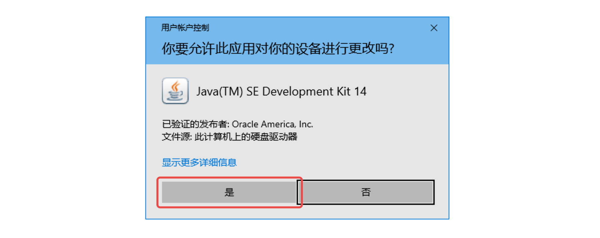
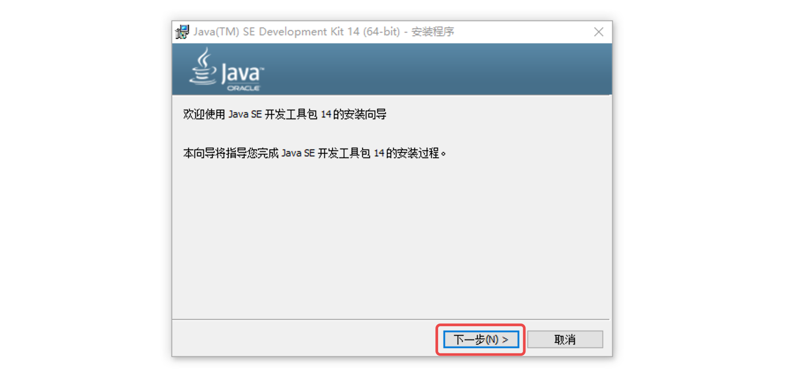
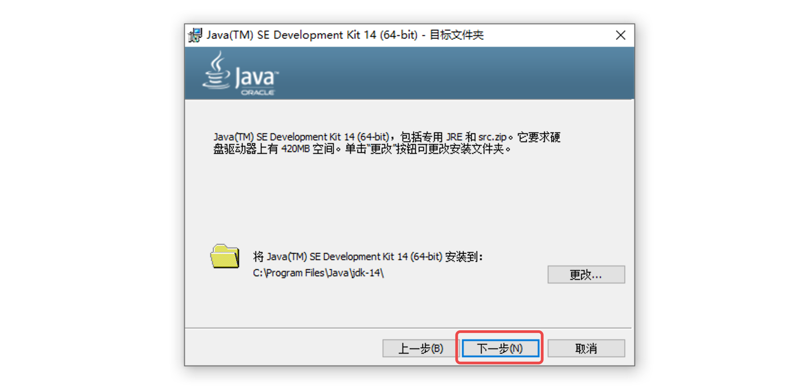
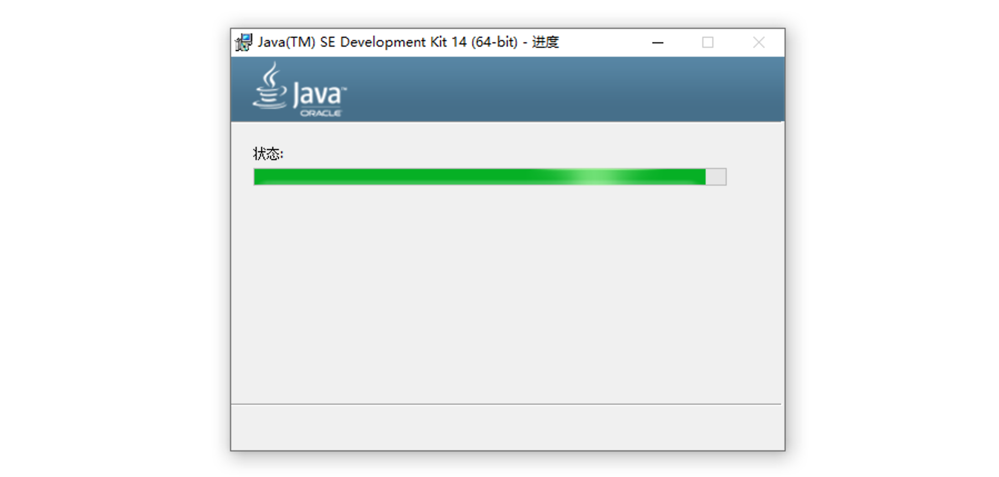
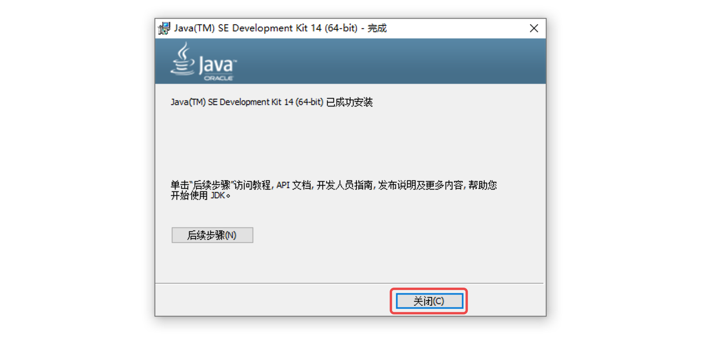
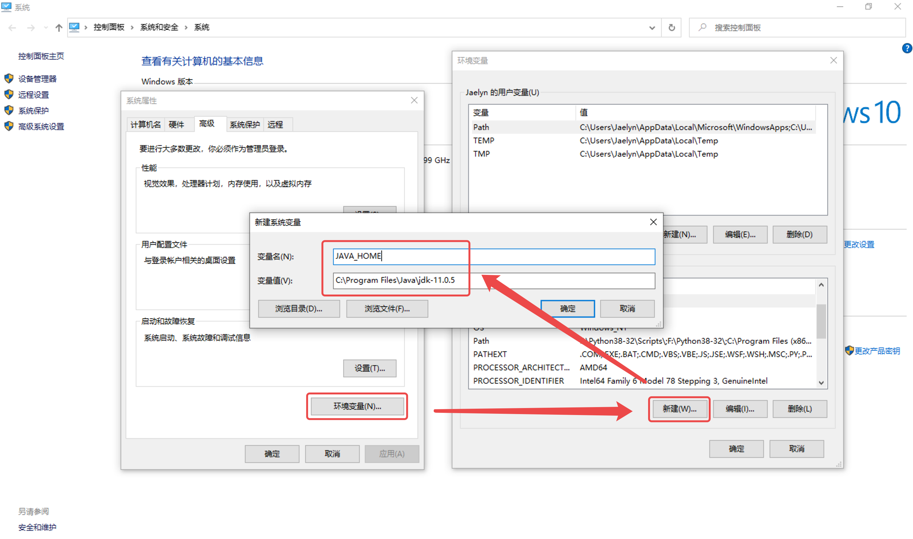
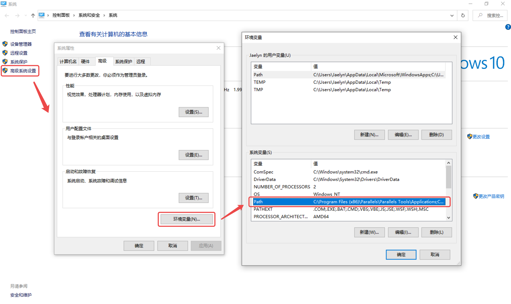
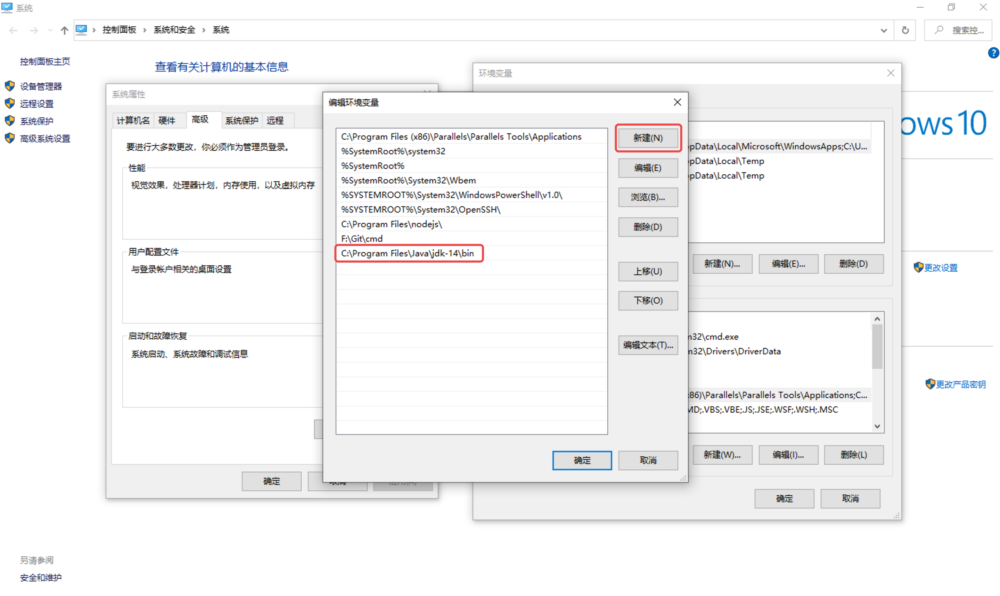

# JDK 配置

## 1. 安装





如果要更改安装路径可点击「更改」，建议文件夹命名还是采用默认路径一样的命名。







## 2. 配置环境变量

### 配置 JAVA_HOME



变量名设置为“JAVA_HOME”，变量值设置为我们自己 JDK 的安装路径。

### 配置 Path

双击打开 Path 变量：



新增 JDK 的 bin 目录路径：



## 3. 查看版本

「win + r」输入 cmd 打开命令行工具，输入以下命令查看版本信息：

```bash
java --version
```


能输出安装的 Java 版本信息就证明配置没有问题了。