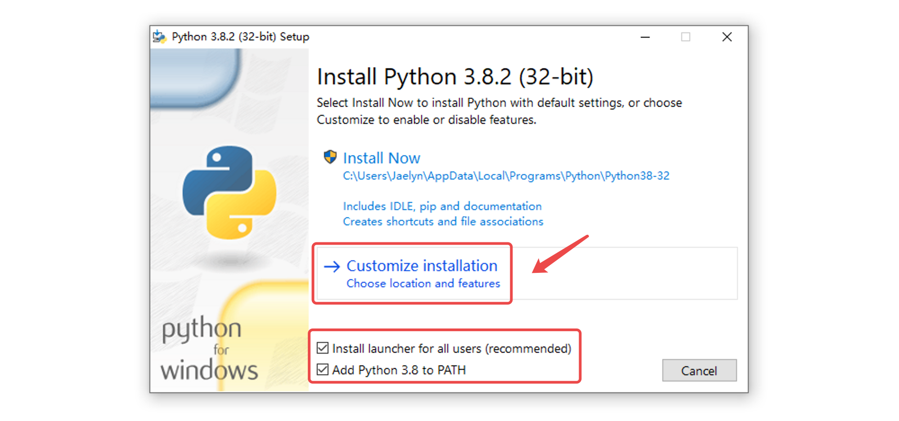
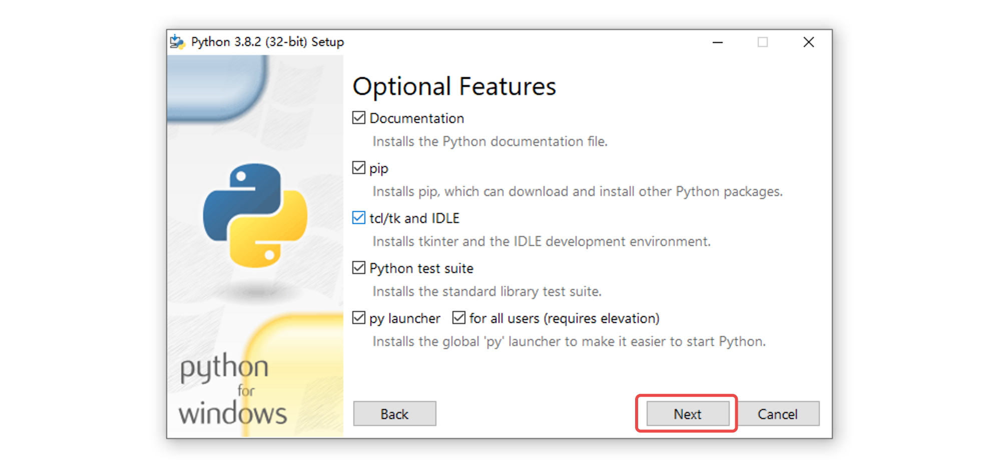
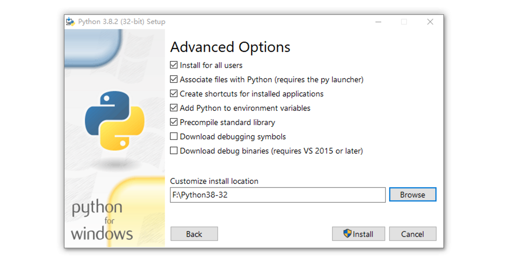
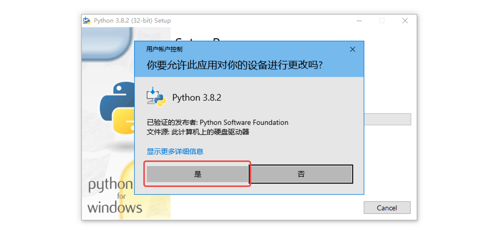
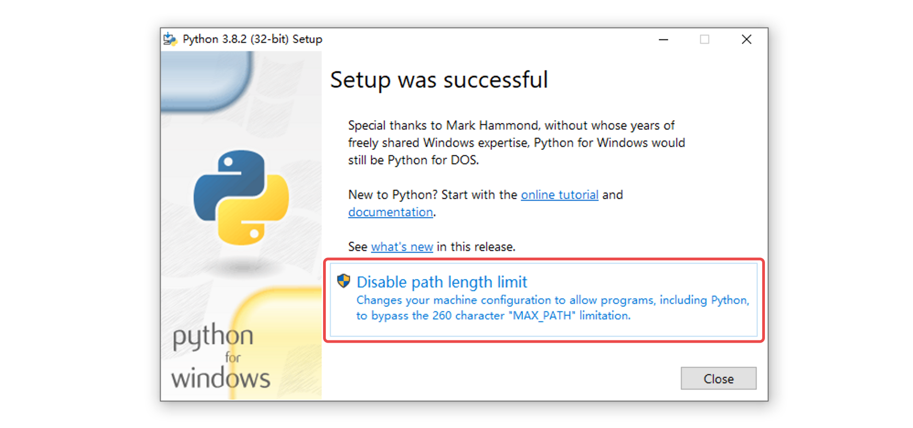
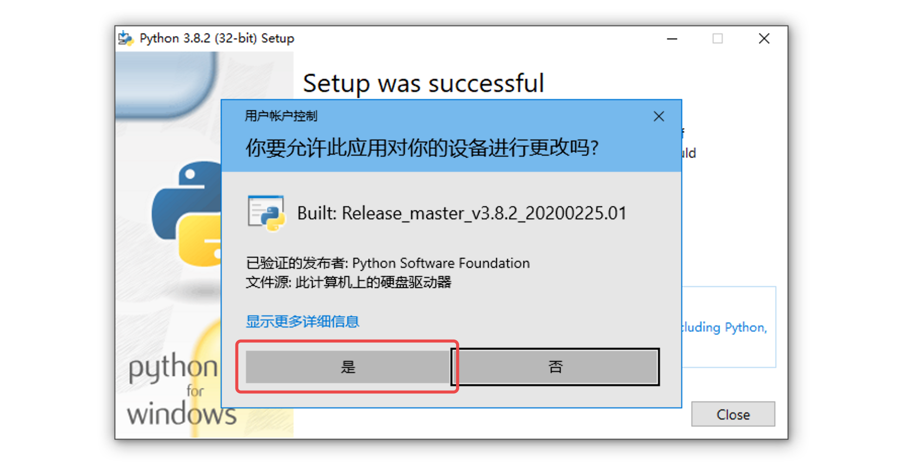
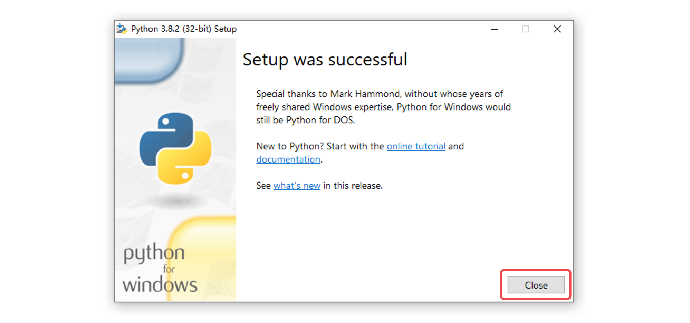
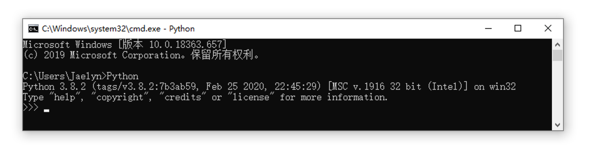

# Python 安装配置

## 1. 下载

## 2. 安装










如果出现下列红框中的「Disable path length limit」，点击它，若有弹窗选择「是」；没有则跳过。







## 3. 检测是否安装成功

「win + r」输入 cmd 打开命令行工具，输入以下命令检测是否安装成功：

```bash
Python
```



这样就代表安装成功了。