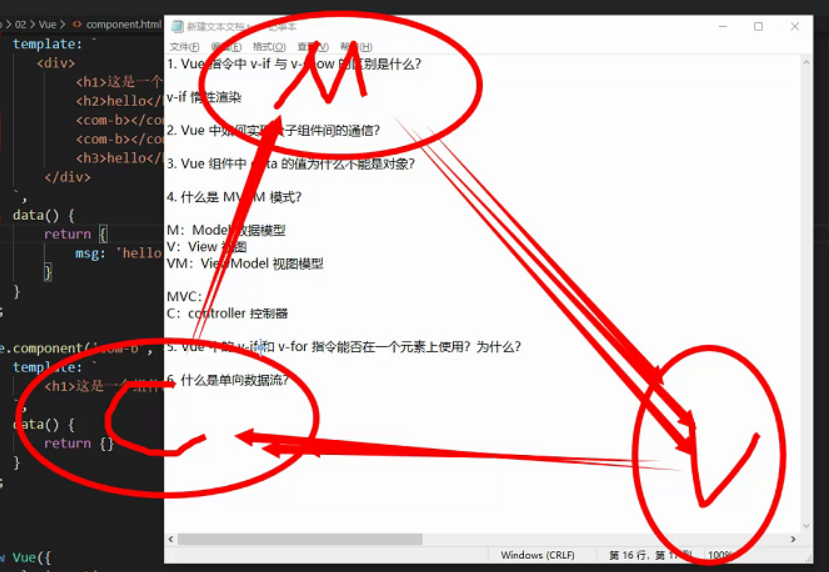

# **Html**

#### h5常用结构标签：**

1. <header></header>

2. <nav></nav>

3. <section></section>

4. <aside></aside>

5. <footer></footer>✨眼神要好

6. <article></article>

#### H5版本中新提出的表单控件

1. 电子邮件

   <input type="email">

   表单提交时，会验证数据是否符号email的规范（有@，并且@后面有内容）

2. 搜索类型

   <input type="search">

   提供了快速清除的功能

3. url类型

   <input type="url">

   提交时，验证数据是否符合url的规范（http://****）

4. 电话号码类型

   <input type="tel">

   在移动设备中，显示拨号键盘

5. 数字类型

   <input type="number">

   属性：

   - value 默认显示的值
   - max 能接收到的最大值
   - min 能接收到的最小值
   - step 每次调整数字时，步数大小

6. 范围类型

   <input type="range">

   提供一个滑块组件，允许用户选取指定范围的值

   属性：

   - value 默认显示的值
   - max 最大值
   - min 最小值
   - step 步长

7. 颜色类型

   <input type="color">

   提供一个颜色拾取器✨

8. 日期类型

   <input type="date">

9. 月份类型

   <input type="month">

10. 周类型

    <input type="week">

#### **文字换行**

**不换行也不省略 ：** 

word-break : keep-all;

white-space : nowrap; 

**不换行，超出用省略号代替 :** 

word-break : keep-all;

white-space : nowrap;

overflow : hidden;

text-overflow : ellipsis;


#### 动画

transform:旋转 div 元素;

translate:移动，是transform的一个方法;

transition:属性是一个简写属性，用于设置四个过渡属性：

#### **HTML5**中常用的新特性：

**canvas****元素：用于定义图形（图表等），只是图形容器，必须使用脚本来绘制图形。**

**audio****：用于音频播放。**

**video****：用于视频播放。**

**article****：规定独立的自包含内容。**

**header****：定义文档的页眉，介绍相关信息。**

**section****：定义文档中的节。**

**footer****：定义文档的页脚，通常有文档的作者、版权信息、联系方式等。**

**nav****：定义导航链接。**

**表单控件：**

**calender**

**date**

**time**

**email**

**url**

**search**

#### **哪些HTML元素可以获得焦点**

正确答案: A B D  你的答案: B C D (错误)

```
<div contenteditable="true">我可以</div>
<p tabindex="1">我可以</p>
<a id="yes">我可以</a>
<input type="text" value="我可以" />
```

a标签没有设置href属性时是不能获取到焦点的


1.contenteditable：true|false 规定元素文本是否可编辑；

2.tabindex：0 | -1 | x

0：tab键可获取焦点；

-1：tab键不可获取焦点；

x：x>0，x越小获取焦点优先级越高；

#### **html5手册语义化标签：**

article

section

aside

hgroup

header

footer

nav

time

mark

figure

figcaption

contextmenu+menu


#### background 可以在body中有这个属性

学法是对的

```
<body background="background.gif">可以插入背景图 
```

#### a**标签** target 属性

| 值          | 描述                                 |
| :---------- | :----------------------------------- |
| _blank      | 在新窗口中打开被链接文档。           |
| _self       | 默认。在相同的框架中打开被链接文档。 |
| _parent     | 在父框架集中打开被链接文档。         |
| _top        | 在整个窗口中打开被链接文档。         |
| *framename* | 在指定的框架中打开被链接文档。       |

HTML5 之前的 HTML 版本是

4.01版本


#### **input标签  disabled readonly  区别**

设置readonly = true，页面上无法修改内容，但是可以通过JavaScript修改,内容会被提交

设置disabled = true,无法修改内容，也不会被提交

# **css**

D是对的，解析CSS构建CSSOM会阻塞JS的执行，不阻塞JS的加载。所以要把CSS文件放在前面加载。

#### 什么是重绘与回流？

重绘就是重新绘制，比如display：none 就是回流 和 visibility：hidden 就是重绘


**答案**

浏览器在加载页面的时候会生成一个render（渲染）树，加载完成后当渲染树中的某一些元素发生了比如形状，尺寸，隐藏，由于元素之间位置的相互关系发生改变，都会使渲染树发生改变，从而需要重新构建渲染树，这叫回流
而当渲染树中的某些元素发生的改变不会影响个元素之间的位置关系，比如color，background等只是改变外观，则不需要重建渲染树，这就叫做重绘。
区别:当发生回流时一定发生了重绘，但是当发生重绘时则不一定发生回流


#### 将多个元素设置为同一行?清除浮动有几种方式?**

 Float  

 文本不换行 white-space:nowrap;

 清除浮动的方式

 触发BFC overflow:hidden 写一个父类 clear之类的

 伪元素  content:””;clear:both;display:block;


#### 1、怪异盒模型box-sizing？弹性盒模型|盒布局?

***\*在标准模式下，一个块的总宽度= width + margin(左右) + padding(左右) + border(左右)\****

IE盒模型或怪异盒模型 ***\*一个块的总宽度= width + margin(左右)（即width已经包含了padding和border值）\****


#### **css hack**

CSS hack是通过在[CSS样式](http://www.w3cschool.cn/codecamp/style-the-html-body-element.html)中加入一些特殊的符号，让不同的浏览器识别不同的符号（什么样的浏览器识别什么样的符号是有标准的，CSS hack就是让你记住这个标准），以达到应用不同的[CSS](http://www.w3cschool.cn/css)样式的目的。

#### **href和src区别? title和alt?**

href 超文本 引用  指定网络资源的位置 在 link 和a 等 元素上使用

src 仅仅 嵌入当前资源到当前文档元素 定义的位置， script1用的到

***\*title\****：既是html标签，又是html属性，title作为属性时，用来为元素提供额外说明信息.
***\*alt\****：alt是html标签的属性，用于网页中图片无法正常显示时给用户提供文字说明使其了解图像信息.是给搜索引擎识别的。


#### 响应式和自适应的区别是什么？

响应式布局，只要页面宽度大小或者高度大小发生变化时，页面的布局会随着页面页面宽度改变而改变布局 最常用的是media，也可以是用一些ui的布局实现响应式，

自适应布局，根据 页面的宽度或者高度，自己识别响应的布局。 


答案：

响应式网页布局设计就是一个网站能够兼容多个终端——而不是为每个终端做一个特定的版本。打个比方来说：现在社会有很多响应产品，例如折叠沙发，折叠床等等，当我们需要把沙发放到一个角落的时候，此刻沙发就好比div吧，而角落里的某个地方就好比父元素，由于父元素空间的改变，我们不得不调整div,让它能够依然放在角落里。在项目中你会遇到不同的终端，由于终端分辨率不同，所以你要想让用户体验更好，就必要让你的页面能够兼容多个终端。

 自适应网页布局设计指网页能够在不同大小的终端设备上自行适应显示。简单来说：就是让一个网站在不同大小的设备上呈现显示同一样的页面，让同一个页面适应不同大小屏幕，根据屏幕的大小，自动缩放。

#### **transform？animation？区别?animation-duration？**


**1 transition样式过渡，从一种效果逐渐改变为另一种效果**


transition是一个合写属性

transition:transition-property transition-duration transition-timing-function transition-delay

从左到右分别是：css属性、过渡效果花费时间、速度曲线、过渡开始的延迟时间


2 transform：描述了元素的静态样式，本身不会呈现动画效果，可以对元素进行 旋转rotate、扭曲skew、缩放scale和移动translate以及矩阵变形matrix。**

div{ 　transform:scale(2); }

**区别：**

（1）**transform仅描述元素的静态样式，常常配合transition和animation使用**

（2）**transition通常和hover等事件配合使用，animation是自发的，立即播放**

（3）**animation可设置循环次数**

（4）**animation可设置每一帧的样式和时间，transition只能设置头尾**

（5）**transition可与js配合使用，js设定要变化的样式，transition负责动画效果，**

#### 3、animation动画 由@keyframes来描述每一帧的样式

```
div{
　　animation:myAnimation 5s infinite
}
@keyframes myAnimation {
　　0%{left:0;transform:rotate(0);}
　　100%{left:200px;transform:rotate(180deg);}
}
```

# **JS**

```
[...[``1``,,``3``,,``5``]].map((_, n) => n);
```

map遍历回调函数传两个参数，第一个是item，第二个是index,这里返回的是index,即数组下标，所有是[0,1,2,3,4]

#### **JavaScript 中包含哪些数据类型？**

基本类型 string number Boolean  underfind null symbol

引用类型  array object


#### **underfine 为true**

"" 判断为false

#### **从字符串 const str = 'qwbewrbbeqqbbbweebbbbqee';中能得到结果 ["b", "bb", "bbb", "bbbb"] 以下错误语句是？**

正确答案: B  你的答案: A (错误)

```
/b+/g  ``//匹配前面的子表达式一次或多次，有一个或多个b
```

 

```
/b*/g  ``//匹配前面的子表达式零次或多次,结果不止数组中那么多
```

 

```
/b{``1``,``4``}/g  ``//匹配1-4个b
```

```
/b{``1``,``5``}/g  ``//匹配1-5个b
```


```
str.match(/b+/g)
str.match(/b*/g)
str.match(/b{1,4}/g)
str.match(/b{1,5}/g)
```

#### **箭头函数与普通函数的区别是什么？**

this的指向不同，箭头函数不会影响this，this指代他的上级

**答案：**

**一.外形不同：**

箭头函数使用箭头定义，普通函数中没有。

```
// 普通函数
function` `func(){
 ``// code
}
// 箭头函数
let` `func=()=>{
 ``// code
}
```

**二.箭头函数全都是匿名函数：**

普通函数可以有匿名函数，也可以有具名函数。

```
// 箭头函数全都是匿名函数
let` `func=()=>{
 ``// code
}
```

**三.箭头函数不能用于构造函数：**

普通函数可以用于构造函数，以此创建对象实例。

```
function` `Antzone(webName,age){
  ``this``.webName=webName;
  ``this``.age=age;
}
let` `antzone=``new` `Antzone(``"蚂蚁部落"``,5);
console.log(antzone.webName);
```

**四.箭头函数中this的指向不同：**

this一直是让初学者比较头疼的概念。

在普通函数中，this总是指向调用它的对象或者，如果用作构造函数，它指向创建的对象实例。

（1）默认指向定义它时，所处上下文的对象的this指向。即ES6箭头函数里this的指向就是上下文里对象this指向，偶尔没有上下文对象，this就指向window

（2）即使是call，apply，bind等方法也不能改变箭头函数this的指向


**五.箭头函数不具有arguments对象：**

每一个普通函数调用后都具有一个arguments对象，用来存储实际传递的参数。

但是箭头函数并没有此对象。

关于arguments对象可以参阅[JavaScript arguments对象](https://www.softwhy.com/article-8818-1.html)一章节。

**六.其他区别：**

（1）.箭头函数不能Generator函数。

（2）.箭头函数不具有prototype原型对象。

（3）.箭头函数不具有super。

（4）.箭头函数不具有new.target。


#### 列举几种你知道的实现数组去重的方式。

1 new set 可以去除，

```
let arr=[xxxx,xx]
let s=new.set(arr)
```

2.通过indexOf
注：如果要检索的字符串值没有出现，只会查找某数据第一次出现的位置，则该方法返回 -1

```
for(var i=0; i<len;i++){
    var arr=array[i];
    if(array1.indexOf(arr)===-1){ 
        array1.push(arr);
     }
```


3  双循环 遍历


#### 什么是垃圾回收机制？

不要的就丢了


***答案**：由于字符串、对象和数组没有固定大小，所有当他们的大小已知时，才能对他们进行动态的存储分配。JavaScript程序每次创建字符串、数组或对象时，解释器都必须分配内存来存储那个实体。只要像这样动态地分配了内存，最终都要释放这些内存以便他们能够被再用，否则，JavaScript的解释器将会消耗完系统中所有可用的内存，造成系统崩溃。*


```
var a = "before";
var b = "override a";
var a = b; //重写a
```

　　这段代码运行之后，“before”这个字符串失去了引用（之前是被a引用），系统检测到这个事实之后，就会释放该字符串的存储空间以便这些空间可以被再利用。

#### 什么是闭包

简单来说 就是函数a里面定义了一个函数b，函数b可以使用函数a的所有变量和参数，我们就将这种情况称为闭包

优点： 闭包可以缓存数据，延长作用域链，在函数内部使用父级作用域的变量，可以缓存数据

缺点：用了后，局部变量不能及时释放。

#### 为什么要用setTimeout模拟setInterval ？

setInterval缺点 与 setTimeout

> 再次强调，定时器指定的时间间隔，表示的是何时将定时器的代码添加到消息队列，而不是何时执行代码。所以真正何时执行代码的时间是不能保证的，取决于何时被主线程的事件循环取到，并执行。

综上所述，setInterval有两个缺点：

**使用setInterval时，某些间隔会被跳过；
可能多个定时器会连续执行；
可以这么理解：每个setTimeout产生的任务会直接push到任务队列中；而setInterval在每次把任务push到任务队列前，都要进行一下判断(看上次的任务是否仍在队列中)。

因而我们一般用setTimeout模拟setInterval，来规避掉上面的缺点。

#### 递归

就是调用自己的一种编程技巧，在程序中广泛使用。比如 用settimeout代替 setinterval， 是循环运算的一种模式

满足要求：

1.递归调用必须要有结束条件。

2.递归要有调用过程


#### **循环中保存循环变量 只能保存到最后一次循环变量的值**（let）

解决：使用let ，

let变量  和 const 变量

let 是 es6 语法 中关键的子， 定义局部变量， 让js 有了真正的块级作用域。 没有变量提升

**作用**：新增块级作用域，弥补了vaar 关键字的一些缺陷。

**使用**：使用let 可以定义局部变量，let 定义的变量只能在当前的代码块运行

**特点**： 

块级作用域  

不存在变量的提升  

暂时性死区


#### **浅克隆 深克隆**


#### **继承 多态**


重写


#### **onscroll 事件在元素滚动条在滚动时触发。**


#### 阻止默认事件

e.preventDefault()

e.returnValue = false (IE)

阻止冒泡：

e.stopPropagation()

e.cancelBubble = true (IE)


#### **原型链继承**

#### `getComputedStyle`

是一个可以获取当前元素所有最终使用的CSS属性值。返回的是一个CSS样式声明对象([object CSSStyleDeclaration])，只读。

例如：


```
var dom = document.getElementById("test"),
    style = window.getComputedStyle(dom , ":after");
```

```dart

```

#### **children** 

4.通过children来获取子节点
 利用children来获取子元素是最方便的，他也会返回出一个数组。对其获取子元素的访问只需按数组的访问形式即可。


```dart
var getFirstChild = document.getElementById("test").children[0];
```


#### **nextSibling**会获取下一个兄弟元素节点（x)

**注释：**元素中的空格被视作文本，而文本被视作文本节点。

请尝试在两个

元素之间添加空格，结果将是 "undefined"。


#### 不支持冒泡事件的事件

冒泡事件很多，个人觉得记住常见的不支持冒泡事件就可以了

有：①focus

​    ②blur

​    ③mouseenter

​    ④mouseleave

​    ⑤load

​    ⑥unload

​    ⑦resize  当调整浏览器窗口大小时，发生 resize 事件。

#### **遍历数组内置方法map every  some 的区别**

map()：通过指定函数处理数组的每个元素，并返回处理后的数组。

some()：用于检测数组中的元素是否满足指定条件（函数提供）

every：用于检测数组所有元素是否都符合指定条件（通过函数提供）

filter：创建一个新的数组，新数组中的元素是通过检查指定数组中符合条件的所有元素 （筛选）


#### **set和map 数据结构** 区别

set 和数组类似，但是数组中元素不重复 

map 对象 存储键值对形式， 和对象 键 不同， map 键可以为任意值


#### **JS里，声明函数中**

第 1 种： function foo(){...} （函数声明）
第 2 种： var foo = function(){...} （等号后面必须是匿名函数，这句实质是函数表达式）

除此之外，类似于 var foo = function bar(){...} 这样的东西统一按 2 方法处理，即在函数外部无法通过 bar 访问到函数，因为这已经变成了一个表达式。

但为什么不是 "undefined"？
这里如果求 typeof g ，会返回 undefined，但求的是 g()，所以会去先去调用函数 g，这里就会直接抛出异常，所以是 Error。


#### **数据类型转换  boolean判断**


这里涉及到数据类型转换

**1.没有内容就是undefined,这个就是false**

**2.0就是false,1是true**

**3.null跟undefined一样,都是false**

**4.字符串里面有内容的话才是true,没有内容就是false**

**5.NaN是一种数值类型,已经是false了,只是为了让程序继续往下面走**

**其他解析: 数值只要不是0,都是true   对象object永远都是true**


#### 原生ajax 的四个步骤

1 创建 一个核心 对象 xmlhttpRequest()

2  建立 连接:   

3  发送数据

4 得到（服务端）的返回的响应结果


#### **join 讲数组变为 字符串   split 分割字符串变为数组**


#### **鼠标 移入 移出 事件**


mouseenter 和 mouseleave 就不会

#### **over out 子元素也会触发**


#### Object.defineProperty 

经常使用的定义与赋值方法`obj.prop =value`或者`obj['prop']=value`

在 Object.defineProperty()语法说明

`Object.defineProperty()`的作用就是直接在一个对象上定义一个新属性，或者修改一个已经存在的属性

三个参数

```css
Object.defineProperty(obj, prop, desc)
```

1. obj 需要定义属性的当前对象
2. prop 当前需要定义的属性名
3. desc 属性描述符

```csharp
let Person = {}
Object.defineProperty(Person, 'name', {
   value: 'jack',
   writable: true // 是否可以改变 默认 不写 是false
})
```


#### **什么是原型链**

每一个对象都有一个构造函数，每一个构造函数都有一个prototype的对象，我们把prototype理解为原型对象，而prototype这个对象也有一个他自己的prototype的原型对象，一层套一层，就变成了原型链，而原型链最终 指向OBbject


答案


# VUE**

#### vue是虚拟节点


#### **v-if 和v-show**

v-show 第一次渲染要慢一点，但是节点都渲染了，所以后续如果要显示他的话，v-show要快点 而v-if 不满足条件的节点没有渲染，所以不会开销性能去渲染，那么初次渲染要快点，但是不停切换的话，性能开销就会大一点


#### 事件修饰符

prevent 阻止默认事件

提交事件不再重载页面

 @submit.prevent

.stop 阻止单击事件继续传播

@click.prevent="myevent(xx)";


> 2.1.4 新增

```
<!-- 点击事件将只会触发一次 -->
<a v-on:click.once="doThis"></a>
```

正常事件不能带传参的，但是vue独有 可以！


#### slot插槽

如果我希望父组件可以决定子组件的一些页面显示内容，可以使用slot插槽


插槽有默认值（插槽后背选项） 


作用域插槽

父组件决定子组件的数据如何渲染


#### **vue中如何实现父子组件间的通信**

父传子 通过props      

单向数据流


子传父： 自定义事件， 子组件内$emit


#### v-if 和v-for 

v-if  和 v-for 优先级不一样， v-for 优先级要高一点  所以有可能v-for先执行 然后v-if在执行，


#### 写 React / Vue 项目时为什么要在列表组件中写 key，其作用是什么？

如果不写key的话，会报错, 因为列表组件 不唯一

**答案**：vue和react都是采用diff算法来对比新旧虚拟节点，从而更新节点。在vue的diff函数中（建议先了解一下diff算法过程）。
在交叉对比中，当新节点跟旧节点头尾交叉对比没有结果时，会根据新节点的key去对比旧节点数组中的key，从而找到相应旧节点（这里对应的是一个key => index 的map？映射）。如果没找到就认为是一个新增节点。而如果没有key，那么就会采用遍历查找的方式去找到对应的旧节点。一种一个map映射，另一种是遍历查找。相比而言，map映射的**速度更快**。

**因为更快更精确**

#### **Vue 的组件中 data** 为什么不能是对象？

不是都是对象吗？


**答案**：`data`数据都应该是相互隔离，互不影响的  一般都是对象后，要new一下放在实例上，而实例只有一个 不能共用 自己改自己就没有影响，都是在使用同一个引用地址，如果return 就能实现得到自己的data

因为如果是对象的话，那么其他组件改变data里面的某属性值，其他的组件在使用data的这个属性值时，属性值也改变了，所以用 利用函数 return，每次返回的都是一个新的data 


React 中 setState 什么时候是同步的，什么时候是异步的？

当不再事件中都是同步的

**答案**  setState 只在合成事件和钩子函数中是“异步”的，在原生事件和 setTimeout 中都是同步的。

合成事件：就是react 在组件中的onClick等都是属于它自定义的合成事件

原生事件：比如通过addeventListener添加的，dom中的原生事件


#### 

#### vue 双向数据绑定原理


#### Vue 中 watch 和 computed 的区别是什么？

Vue中watch常用于监听 data数据改变，而computer用于 处理data的逻辑运算。

答案：computed 可以关联多个实时计算的对象，支持缓存，只有依赖数据发送改变，才会重新进行计算。

不支持异步，当computed内有异步操作时无效，无法监听数据的变化

computed 属性值会默认走缓存，计算属性是基于他们的响应式依赖进行缓存的，


#### ***简单描述 Vue 2.x 中响应式的原理。

　　Vue 的响应式原理是核心是通过 ES5 的保护对象的 Object.defindeProperty 中的访问器属性中的 get 和 set 方法，data 中声明的属性都被添加了访问器属性，当读取 data 中的数据时自动调用 get 方法，当修改 data 中的数据时，自动调用 set 方法，检测到数据的变化，会通知观察者 Wacher，观察者 Wacher自动触发重新render 当前组件（子组件不会重新渲染）,生成新的虚拟 DOM 树，Vue 框架会遍历并对比新虚拟 DOM 树和旧虚拟 DOM 树中每个节点的差别，并记录下来，最后，加载操作，将所有记录的不同点，局部修改到真实 DOM 树上。


#### 什么是 Virtual DOM？为什么 Virtual DOM 比原生 DOM 快?

virtual dom  就是虚拟dom 我们在使用原生dom 操作时，首先文档要对dom树进行解析，dom树一层一层的往下伸展直到尽头，当页面发送改变时，我们就会重新构建dom树，但是虚拟dom 他是 将改变的记录下来，然后和原来的对比，把有差异的地方进行保存下来进行修改，所以自然就更快了


#### vue组件间的生命周期是什么

vue的生命周期指从创建到销毁一系列的一个过程，通过vue生命周期的一些钩子函数

可以实现一些在各个阶段的操作


#### vue组件间的参数传递方式？


# **REACT**

#### **什么是 React ？**

react是一个开源的前端js库，用于构建用户界面。尤其是单页应用程序。它用于处理网页和移动应用程序的视图层。 是有facebook 的创建的

#### **react的特点**

考虑到真实的DOM操作成本很高，他使用虚拟dom而不是真实dom 渲染，

支持服务端渲染。

遵循单向数据流或数据绑定

#### **什么是jsx**

jsx 是ECMAScript  的一个类似的语法扩展 可以让我们在js中使用html模板语法

```js
class App extends React.Component {

 render() {

  return(

      <div>

​    <h1>{'Welcome to React world!'}</h1>

   </div>

  )

 }

}
```


#### **React 中函数组件和类组件有什么区别？**

函数组件 没有生命周期也没有state，如果要使用类似state 要借用hook

而类组件都有，所以可以实现更多的功能，比如 props传值问题

答案：函数组件和类组件，首先，函数组件性能要比类组件性能高，

因为类组件使用需要 实例化，而函数组件直接执行返回结果就ok，

函数组件没有 this，没有生命周期，没有状态state，如果要实现更多功能可以用hook

而类组件 有this, 有生命周期，有state


#### **什么是 MVVM？与 MVC 有什么区别？**MVC的区别

M: Model 数据模型，专门用来操作数据，数据的CRUD。

V：View 视图，就是我们在浏览器中所看到的页面。

C：Controller 控制器，是视图和数据模型沟通的桥梁，处理业务逻辑都在控制器。

M：model数据模型，专门用来操作数据，数据的CRUD。

V：view视图，就是我们在浏览器中所看到的页面。

VM：ViewModel 视图模型，这个是数据的核心。

MVVM model（ 数据模型）-view-viewmodel。 mvc model -view- Controller（ 管理者，控制者,即这里用于业务逻辑）

即mvc 的 view 可以直接访问 model 

**MVC的思想：一句话描述就是Controller负责将Model的数据用View显示出来，换句话说就是在Controller里面把Model的数据赋值给View。**


简单的说controller 是一个中间枢纽  负责用户 和应用的响应操作  当用户与 view 页面有交互时， controller触发器就开始工作了，通过调用model层，完成model的修改，然后model层再去通知view层更新

###### MVC优点：

耦合性低，视图层和业务层分离，这样就允许更改视图层代码而不用重新编译模型和控制器代码。
重用性高
生命周期成本低
MVC使开发和维护用户接口的技术含量降低
可维护性高，分离视图层和业务逻辑层也使得WEB应用更易于维护和修改
部署快

MVC缺点：

不适合小型，中等规模的应用程序，花费大量时间将MVC应用到规模并不是很大的应用程序通常会得不偿失。

视图与控制器间过于紧密连接，视图与控制器是相互分离，但却是联系紧密的部件，视图没有控制器的存在，其应用是很有限的，反之亦然，这样就妨碍了他们的独立重用。

视图对模型数据的低效率访问，依据模型操作接口的不同，视图可能需要多次调用才能获得足够的显示数据。对未变化数据的不必要的频繁访问，也将损害操作性能。


###### MVP优点：

模型与视图完全分离，我们可以修改视图而不影响模型；
可以更高效地使用模型，因为所有的交互都发生在一个地方——Presenter内部；
我们可以将一个Presenter用于多个视图，而不需要改变Presenter的逻辑。这个特性非常的有用，因为视图的变化总是比模型的变化频繁；
如果我们把逻辑放在Presenter中，那么我们就可以脱离用户接口来测试这些逻辑（单元测试）。
MVP缺点：

视图和Presenter的交互会过于频繁，使得他们的联系过于紧密。也就是说，一旦视图变更了，presenter也要变更。
————————————————


**MVVM通过`数据双向绑定`让数据自动地双向同步，V修改数据自动同步M、M修改数据自动同步到V** 

将 View 和 Model 的同步更新给自动化了。当 Model 发生变化的时候，ViewModel 就会自动更新；ViewModel 变化了，View 也会更新

###### 老师版本


双向箭头 vm相当于是中介 自动触发


MVC：model view controller(控制器)

单方向




**Vue就是这种MVVM模式的框架，无需开发人员手动操作DOM，开发人员只需要关注数据。**


###### MVVM优点：

MVVM模式和MVC模式类似，主要目的是分离视图（View）和模型（Model），有几大优点：

低耦合，视图（View）可以独立于Model变化和修改，一个ViewModel可以绑定到不同的”View”上，当View变化的时候Model可以不变，当Model变化的时候View也可以不变。

可重用性，可以把一些视图逻辑放在一个ViewModel里面，让很多view重用这段视图逻辑。

独立开发，开发人员可以专注于业务逻辑和数据的开发（ViewModel），设计人员可以专注于页面设计，使用Expression Blend可以很容易设计界面并生成xml代码。

可测试，界面向来是比较难于测试的，而现在测试可以针对ViewModel来写。

#### 什么是 Virtual DOM？**

虚拟dom 虚拟节点 它通过 `JS` 的 `Object` 对象模拟 `DOM` 中的节点，然后再通过特定的 `render` 方法将其渲染成真实的 `DOM` 节点。 

1. dom操作是非常昂贵的，而虚拟dom操作 通过对比在判断操作，提高效率
2. js的运行效率是非常高的

#### **在 React 中如何实现实现父子组件、兄弟组件之间的传值？**

父子 自定义属性 传数据 子组件 props 接收即可， 

子组件（通过this.props.事件名(参数)的方式向父组件传递参数）


**兄弟组件之间的传值**

  **两个兄弟组件之间会有一个共同的父组件，我们都是结合父子传值的方式来实现兄弟之间的传值的，即先其中一个子组件（兄弟组件）向父组件传值，然后父组件接收到这个值之后再将值传递给另外一个子组件（兄弟组件）**


#### 在 React 的事件中，多次调用 setState 方法，render 会执行多少次？

一般来说 只要默认情况使用Component 那么使用多少次setState render就会执行多少次， 但是如果使用Purecomponent

#### **Redux** ******

基础：

**Action** 是把数据从应用 传到 store 的有效载荷。**它是 store 数据的唯一来源**。一般来说你会通过 [`store.dispatch()`](https://www.redux.org.cn/docs/api/Store.html#dispatch) 将 action 传到 store。

Action 本质上是 JavaScript 普通对象。**我们约定，action 内必须使用一个字符串类型的 `type` 字段来表示将要执行的动作。多数情况下，`type` 会被定义成字符串常量。当应用规模越来越大时，建议使用单独的模块或文件来存放 action。**

```js
const ADD_TODO = 'ADD_TODO'
{
  type: ADD_TODO,
  text: 'Build my first Redux app'
}
```

```js
import { ADD_TODO, REMOVE_TODO } from '../actionTypes'
```

**Reducers** 指定了**应用状态的变化如何响应 [actions](https://www.redux.org.cn/docs/basics/Actions.html) 并发送到 store** 的，记住 actions 只是描述了*有事情发生了*这一事实，并没有描述应用如何更新 state。


# 其他知识

## WebPack

## 数据库

#### **cookie、localStorage 和 sessionStorage 有什么区别？**

cookie 和localStorage 都是 自身浏览器的 东西， 他是浏览器处理本地化存储的一种方式，而sessionStorage 是服务器上 后端存储数据的一种方式. 而且cookie是以前的技术，且有数据大小限制 比较小，而localStorage 都是10mb的上限。

答案： 共同点，都是保存在浏览器端。

区别： cookie要在**浏览器和服务器来回传递**，而localStorage 和sessionStorage  **不会发送给服务器，只在本地保存**

2 cookie 存储数据大小不能超过4k，而其他两者要大的多，有5m

3 数据有效期不同，sessionStorage 在浏览器窗口关闭之前有效，localStorage

始终有效，除非你删掉，cookie要在 过期找时间之前有效。

4 三者的异同

| 特性           | Cookie                                                       | localStorage                                                | sessionStorage                               |
| :------------- | :----------------------------------------------------------- | :---------------------------------------------------------- | :------------------------------------------- |
| 数据的生命期   | 一般由服务器生成，可设置失效时间。如果在浏览器端生成Cookie，默认是关闭浏览器后失效 | 除非被清除，否则永久保存                                    | 仅在当前会话下有效，关闭页面或浏览器后被清除 |
| 存放数据大小   | 4K左右                                                       | 一般为5MB                                                   |                                              |
| 与服务器端通信 | 每次都会携带在HTTP头中，如果使用cookie保存过多数据会带来性能问题 | 仅在客户端（即浏览器）中保存，不参与和服务器的通信          |                                              |
| 易用性         | 需要程序员自己封装，源生的Cookie接口不友好                   | 源生接口可以接受，亦可再次封装来对Object和Array有更好的支持 |                                              |


**session 是服务端的 和sessionStorage，cookie 是前端的。**
**我们数据保存在服务端的 session 里，保存成功后，会有一个 session 的标记返回到前端，然后保存在 cookie 里**
**你可以理解成 sessionid**
**session 保存成功后，会返回一个 sessionid 给前端，前端把这个 sessionid 保存在 cookie 里**


 

**更简单来说** 

1.首先从字面意思来看,computed是一个计算的属性,类似过滤器,对数据进行处理后return一个新的state,并且可以监听该返回值的变化,而watch是观察是一个动作;

computed

1.是计算值，
2.应用：就是简化tempalte里面{{}}计算和处理props或$emit的传值
3.具有缓存性，页面重新渲染值不变化,计算属性会立即返回之前的计算结果，而不必再次执行函数

watch特性

1.是观察的动作，
2.应用：监听props，$emit或本组件的值执行异步操作
3.无缓存性，页面重新渲染时值不变化也会执行


#### **什么是网络协议**

就是计算机之间的通用语言，都需要遵守一个相同同学规则

#### 简单描述 JavaScript 中的事件循环。

js 事件分文  **宏任务(macro-task)**和**微任务(micro-task)**

到此做个总结，事件循环，先执行宏任务，其中同步任务立即执行，异步任务，加载到对应的的Event Queue中(setTimeout等加入宏任务的Event Queue，Promise.then加入微任务的Event Queue)，所有同步宏任务执行完毕后，如果发现微任务的Event Queue中有未执行的任务，会先执行其中的任务，这样算是完成了一次事件循环。接下来查看宏任务的Event Queue中是否有未执行的任务，有的话，就开始第二轮事件循环，依此类推。

#### **DNS**

域名系统（服务）协议（DNS）是一种[分布式网络](https://baike.baidu.com/item/分布式网络/8951687)[目录服务](https://baike.baidu.com/item/目录服务/10413830)，主要用于域名与 IP 地址的相互转换，以及控制[因特网](https://baike.baidu.com/item/因特网/114119)的[电子邮件](https://baike.baidu.com/item/电子邮件/111106)的发送。

#### 什么是跨域？为什么浏览器要使用同源策略？你有几种方式可以解决跨域问题？了解预检请求嘛？

跨越就是端口号或者ip 不同 但却要相互连接获取接收信息。同源策略防止数据被暴露给其他ip，是网页更加安全


#### 什么是变量提升？什么是暂时性死区？

#### == 和 === 的区别是什么？

#### 如何正确的判断 this？箭头函数的 this 是什么？

#### new 的原理是什么？通过 new 的方式创建对象和通过字面量创建又什么区别？

#### 你理解的原型是什么？

#### call、apply、bind 作用是什么？区别是什么？

#### React 中 Component 和 PureComponent 的区别是什么？